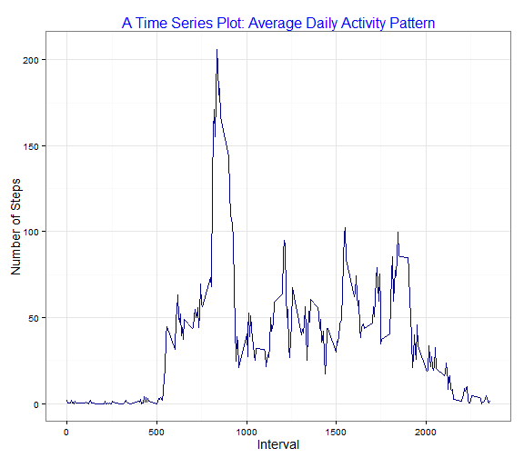
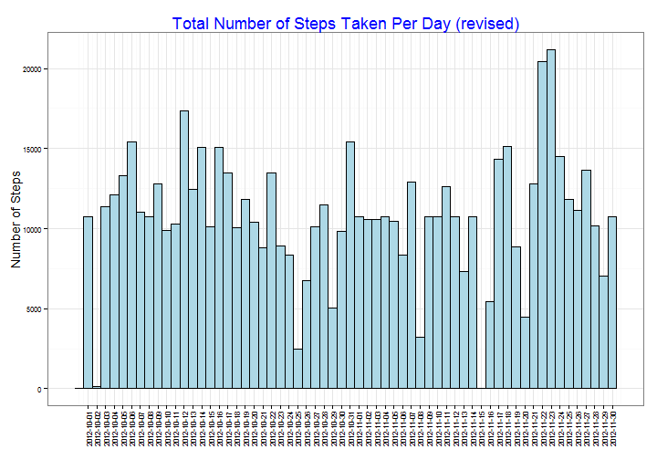

## Reproducible Research: Peer Assessment 1  
  
<br>  
  
### Introduction  

This assignment makes use of data from a personal activity monitoring device. This device collects data at 5 minute intervals through out the day. The data consists of two months of data from an anonymous individual collected during the months of October and November, 2012 and include the number of steps taken in 5 minute intervals each day.  
  
This assignment describes multiple parts data analysis, to include writing a report that answers the questions detailed below. The entire assignment is completed in a single R markdown document that can be processed by knitr and be transformed into an HTML file.  
  
<br>  
  
### Loading and preprocessing the data  
The code chunk to read and to process the original dataset given:  

```r
act = read.csv("activity.csv", sep=",", stringsAsFactors=FALSE)  #read dataset
act$date <- as.Date(as.character(act$date), "%Y-%m-%d")  #format date variable
```
  
<br>  
  
### What is mean total number of steps taken per day?  

```r
#Summarise the dataset:
library(plyr)
dataf = ddply(act, c("date"), summarize, sum=sum(steps))
library(ggplot2)
library(scales)
g = ggplot(dataf, aes(x=date))
p1 = g + geom_histogram(aes(weight = sum), position='identity', binwidth=1,
                   colour='black', fill='lightblue')+
    theme_bw()+
    scale_x_date(breaks=seq(min(dataf$date)+0.5, max(dataf$date)+0.5, by=1), 
                 labels=date_format('%Y-%m-%d'))+
    theme(axis.text.x = element_text(size=rel(0.8), angle=90, vjust=0.5))+
    theme(axis.text.y = element_text(size=rel(0.8)))+
    labs(title='Total Number of Steps Taken Per Day')+
    theme(axis.title.x=element_blank())+
    ylab('Number of Steps')+
    theme(axis.title.y = element_text(size=rel(1.2)))+
    theme(plot.title = element_text(size=rel(1.5), colour='blue'))
```
<br>  
The histogram of the total number of steps taken each day:  

```r
p1 
```

 
<br>  
The mean total number of steps taken per day:

```r
mean(dataf$sum, na.rm=TRUE)
```

```
## [1] 10766
```
The median total number of steps taken per day:

```r
median(dataf$sum, na.rm=TRUE)
```

```
## [1] 10765
```
  
<br>  
  
### What is mean total number of steps taken per day?

```r
#Reformat the dataset:
actn = na.omit(act)  #remove NA from dataset
dataf2 = ddply(actn, c("interval"), summarize, stepMEAN=mean(steps))

p2 = ggplot(dataf2, aes(interval, stepMEAN))+
    geom_line(colour='darkblue')+
    theme_bw()+
    labs(title='A Time Series Plot: Average Daily Activity Pattern')+
    ylab('Number of Steps')+
    xlab('Interval')+
    theme(axis.title.x = element_text(size=rel(1.2)))+
    theme(axis.title.y = element_text(size=rel(1.2)))+
    theme(plot.title = element_text(size=rel(1.3), colour='blue'))
```
<br>  
The time series plot of the 5-minute interval (x-axis) and the average number of steps taken, averaged across all days (y-axis):

```r
p2
```

 
<br>  
The 5-minute interval, on average across all the days in the dataset, contains the maximum number of steps:  

```r
dataf2[which.max(dataf2$stepMEAN),]
```

```
##     interval stepMEAN
## 104      835    206.2
```
At the 104th position, interval at 835, with mean 206.2.  
  
<br>  
  
### Imputing missing values  
  
The total number of missing values in the dataset (i.e. the total number of rows with NAs):  

```r
colSums(is.na(act))
```

```
##    steps     date interval 
##     2304        0        0
```
<br>  
The strategy for filling in all of the missing values in the dataset - to use the mean for that 5-minute interval.  

```r
#The average steps for 5-minute interval value:
m5mi = (mean(dataf$sum, na.rm=TRUE)) /
         ((colSums(is.na(act))[[1]])/(colSums(is.na(dataf))[[2]]))

# New dataset - replaces missing value (NA) with mean steps for 5-minute interval:
act2 = act  #make a copy of the original dataset
act2$steps[is.na(act2$steps)] = m5mi  #replace NA
```


```r
# Make a histogram of the total number of steps taken each day:
dataf3 = ddply(act2, c("date"), summarize, sum=sum(steps))

p3 = ggplot(dataf3, aes(x=date))+
    geom_histogram(aes(weight = sum), position='identity', binwidth=1,
                   colour='black', fill='lightblue')+
    theme_bw()+
    scale_x_date(breaks=seq(min(dataf3$date)+0.5, max(dataf3$date)+0.5, by=1), 
                 labels=date_format('%Y-%m-%d'))+
    theme(axis.text.x = element_text(size=rel(0.8), angle=90, vjust=0.5))+
    theme(axis.text.y = element_text(size=rel(0.8)))+
    labs(title='Total Number of Steps Taken Per Day (revised)')+
    theme(axis.title.x=element_blank())+
    ylab('Number of Steps')+
    theme(axis.title.y = element_text(size=rel(1.2)))+
    theme(plot.title = element_text(size=rel(1.5), colour='blue'))
```
<br>  
The histogram of the total number of steps taken each day for the newly created dataset:

```r
p3
```

 
<br>  
The mean total number of steps taken per day:  

```r
mean(dataf3$sum, na.rm=TRUE)
```

```
## [1] 10766
```
  
The median total number of steps taken per day:

```r
median(dataf3$sum, na.rm=TRUE)
```

```
## [1] 10766
```
<br>  
  
>  
The mean and median values for total number of steps taken per day do not differ from the estimates to the first part of the assignment. Only one step variation on the median value.  
<br>
Since the mean values used to impute the missing data on the estimates of the total daily number of steps are the same, it would produce the same mean results for the estimates of the totaldaily number of steps.  
  
<br>  
  
### Are there differences in activity patterns between weekdays and weekends?  
Create a new factor variable in the dataset with two levels - "weekday" and "weekend" indicating whether a given date is a weekday or weekend day.  

```r
#make a copy of the dataset with the missing data filled in
act3= act2
#add day column
act3$day = weekdays(act3$date)
#add week column for factor weekday/weekend variable
act3$week = format(act3$date, "%w")
act3$week[act3$week>0 & act3$week<6] = "weekday"
act3$week[act3$week==0 | act3$week==6] = "weekend"
act3$week = as.factor(act3$week)
```
  

```r
#Summarise the dataset:
dataf4 = ddply(act3, c("week","interval"), summarize, stepMEAN=mean(steps))
p4 = ggplot(dataf4, aes(interval, stepMEAN))+
    geom_line(colour='darkblue')+
    theme_bw()+
    facet_wrap(~week, ncol=1)+
    labs(title='A Time Series Plot: Averaged Weekday & Weekend Activity Pattern')+
    ylab('Number of Steps')+
    xlab('Interval')+
    theme(axis.title.x = element_text(size=rel(1.2)))+
    theme(axis.title.y = element_text(size=rel(1.2)))+
    theme(plot.title = element_text(size=rel(1.3), colour='blue'))+
    theme(strip.background = element_rect(fill='pink'))
```
<br>  
The time series plot of the 5-minute interval (x-axis) and the average number of steps taken, averaged across all weekday days or weekend days (y-axis):

```r
p4
```

 
<br>  
  
>  
The plots indicate a gradual increase in activity patterns, about 2 hours earlier in the morning during weekday as compare to the weekend, however a lower activity pattern depicted over the daytime and early evening periods.  
  
<br>  
<br>  
